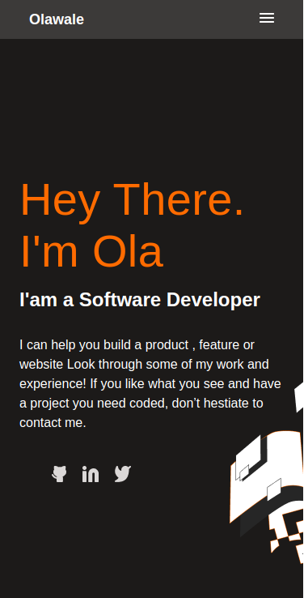

# Portfolio
This is portfolio website that showcases projects I have worked on and more about me as a person. Enjoy!

## Built With 
- Html
- Css

## Getting Started

To get a local copy up and running follow these simple example steps.

- Clone repository

## Author 
- GitHub: [@olawalecoder](https://github.com/olawalecoder)
- Twitter: [@olawalecoder](https://twitter.com/olawalecoder)
- LinkedIn: [LinkedIn](https://linkedin.com/in/bamidele-olawale-072975142)

## Author 2
- GitHub: [@Anny85-code](https://github.com/Anny85-code)
- Twitter: [@Annyudo8](https://twitter.com/Annyudo8)

## Author 3
- GitHub: [@clintonjosephs](https://github.com/clintonjosephs)
- Twitter: [@clintonmbonu_](https://twitter.com/clintonmbonu_)
- LinkedIn: [LinkedIn](https://linkedin.com/in/clinton-mbonu)

## 🤝 Contributing
Contributions, issues, and feature requests are welcome!

Feel free to check the issues page.

## Show your support
Give a ⭐️ if you like this project!

## Acknowledgments

- All accolades to my coding partners

